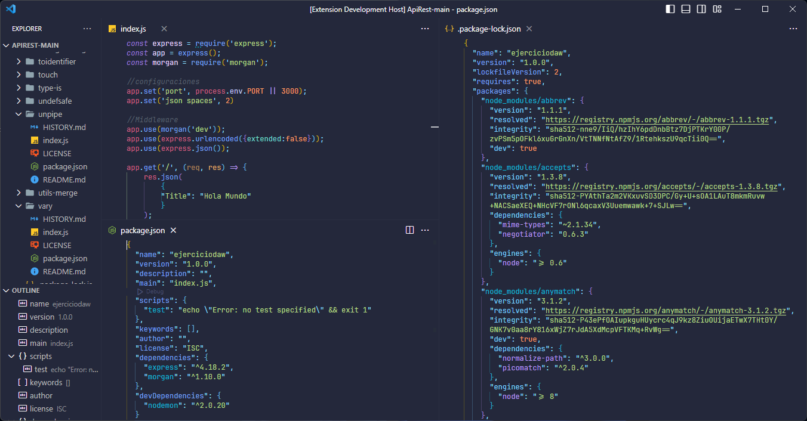

# Theme NIGHT

The night theme has been developed to be used in the visual studio code enviroment. Mainly oriented to a minimalist style and eye care.

## Color palette used

- #FFFFFF - #1B1E2E - #85353E - #BBBBBB - #212538
- #1F1F1F - #C5A804 - #68B3DE - #9A7ECC - #25AAC2
- #80A856 - #C49A5A - #FFD700 - #68B3DE - #9A7ECC
- #25AAC2 - #80A856 - #C49A5A - #3B3B3B - #08B7EC
- #24283B - #1B1E2E - #212538 - #C0CAF5 - #BB9AF7
- #2AC3DE - #E0AF68 - #D9D4CD - #73DACA - #2AC3DE
- #24283B - #E0AF68 - #3D59A1 - #A6333F - #BB616B
- #0DA0BA - #212A2B - #382525 - #262C3A - #383322
- #293735 - #24283B

## theme previews

